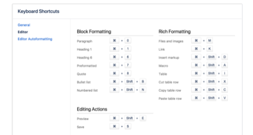
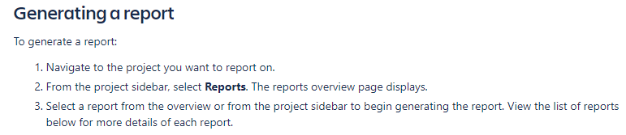
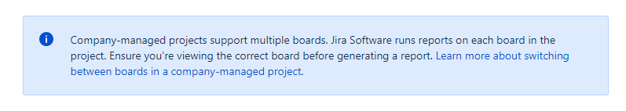
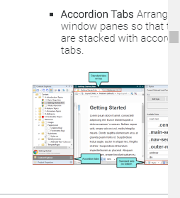

# Advantages and disadvantages of Confluence/JIRA/Flare documentation

  - [Confluence](#confluence)
  - [JIRA](#jira)
  - [Flare](#flare)
## Confluence  
 
* **ADVANTAGES**  

  * On the main page there is a division into major topics. A user can select which topic he is interested in and go from there to a more detailed page. 
  * There is an interesting concept of *‘teams in space’* introduced
  * Thanks to the link maps on the right a user can check where he is, and which points have been learned 
  * ‘Related content’ on the right side can help a user to find related topics and queries 
  * Release notes can be easily accessed
   
* **DISADVANTAGES**
  * Some screenshots are of poor quality (Image 1) 
  * Section called “In this section” very often repeats what is already on the left side of the page 

   Image 1
## JIRA  
* **ADVANTAGES**

  * The Jira documentation provides a wide variety of issues/topics 
  * There are quick links on the right side of the page which refer to specific queries 
  * The documentation consists of clear information, for example, the Jira family is explained at the beginning and divided into project types. Key features are listed. 
  * There are screenshots/images instructing which steps to take  (Image 2) 
  * There is a description in every section 
  * There are warnings (Image 3) and additional crucial information (Image 4) 
  * A modification date at the bottom of the page can be helpful in estimating whether the content is up-t0-date 

   Image 2
   Image 3
   Image 4

* **DISADVANTAGES**  

  * Community Section – a uer can find questions and discussions regarding the Jira software there, which is a significant help for users that have issues with the software. However, most of the questions are left unanswered. The lack of monitoring of the section can demotivate someone to post a question.
## Flare  
* **ADVANTAGES**

  * On the main page there is a division into major topics. A user can select which topic he is interested in and go from there to a more detailed page. 
  * There is an interesting concept of *teams in space* introduced 
  * Thanks to the link maps on the right a user can check where he is, and which points have been learned  
  * *'Related content’* on the right side can help a user to find related topics and queries 
  * Release notes can be easily accessed 
* **DISADVANTAGES**

  * In some screenshots text is unreadable due to a size (Image 5) 
  * Section called *'In this section'* very often repeats what is already on the left side of the page 

 Image 5